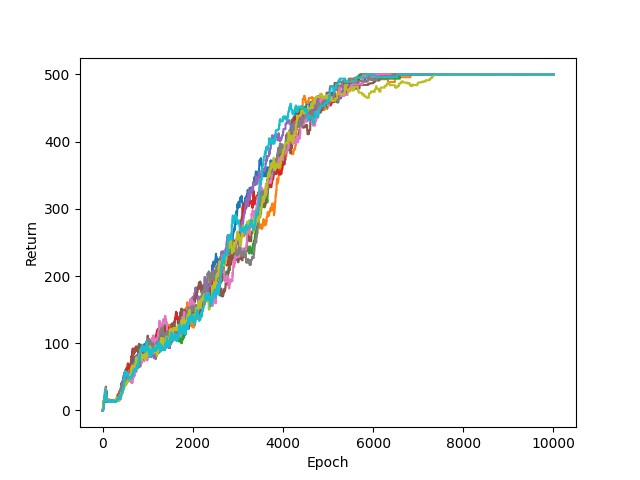

# Jittable_Jax_DQN
A Double DQN implementation in Jax, with the whole training loop being jittable. 

I recently started using Jax and to my surprise couldn't find a jax implementation of DQN which is simple but also highlights the benefits of using Jax. Here I will try to mention some pitfalls that I encountered when transferring from Pytorch to Jax. 

While Pytorch provides all the basic building blocks for training a DQN in one place, things are a bit scattered in jax's case. I use Flax as the neural network library, optax for optimizers, flashbax for the replay buffer, rlax for the loss function and finally gymnax for the vectorized environment.

1) JAX transformation and compilation are designed to work only on Python functions that are functionally pure. Hence, we need to write the environment and the training step as pure functions to get the maximum benefit.

2) When using flashbax's flat buffer, it is really important to store transitions sequentially. What that means is that after adding the transition (s_t, a_t, d_t, r_t), the next call to buffer.add should be made for (s_t+1, a_t+1, d_t+1, r_t+1). The benefits of such an approach is that we don't have to store the same state twice i.e. once when it's the starting state and once when it's the resultant. 

3) Failure to adding transitions in the order as they appear in the environment will result in algorithmic issues. This is because when we sample the batch, we use batch.first.observation and batch.second.observatin to refer to the observations at time t and t+1 of a transition. If they weren't added sequentially, then they will not correspond to any real transitions from the environment. If it is important to add them not in sequence, consider using an item buffer instead. There, the transitions have to be stored as (s_t, a_t, d_t, r_t, s_t+1) instead. 

4) If we are trying to have a completely jittable environment loop, one question is that how do we call reset when the episode ends? Using if statements to check for episode being terminated aren't allowed inside pure functions. The workaround is that environments use an autoreset i.e. for a terminal transition (s_t, a_t, d_t, r_t) -> s_t+1, the next state that we get isn't the terminal state of the current episode but the initial state of a new episode. For learning Q-values this isn't a problem because when writing the Bellman Q-value update i.e. Q(s_t, a_t) = r_t + d_t * V(s_t+1), even if the s_t+1 isn't the actual terminal state, the discount in this case is simply 0.

5) For extra attributes that might be useful, it's best to extend the TrainState dataclass to include extra stuff.

6) Gymnax is amazing. Vectorized environments allow us to run so many in parallel. If you look at the cfg dictionary, we run 64 environments in parallel and perform one step of interaction at each epoch. Flashbax allows adding all the 64 interactions to the buffer together.

7) The LogWrapper provides a simple returned_episode_returns for the returns of all episodes. We simply average them over all environments and plot it as function of each epoch.

Now to the fun stuff. Writing the training loop as a pure function allows us to simply jit the whole train function. In this example, we run not only the environments in parallel, we are able to run the whole code parallelly for 10 different seeds, thanks to the magic of vmap!

Below is the resultant plot for the 10 runs:

On my machine, it took less than 13 seconds in total for all 10 runs!
